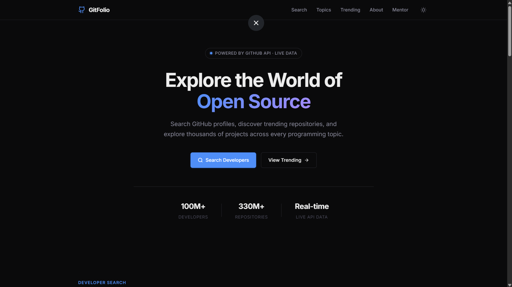
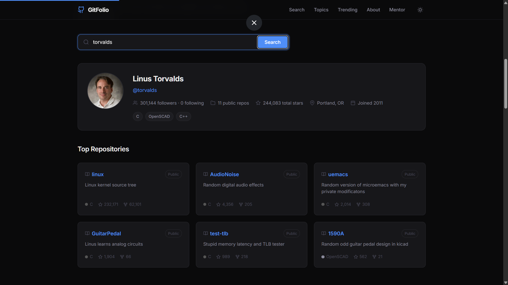
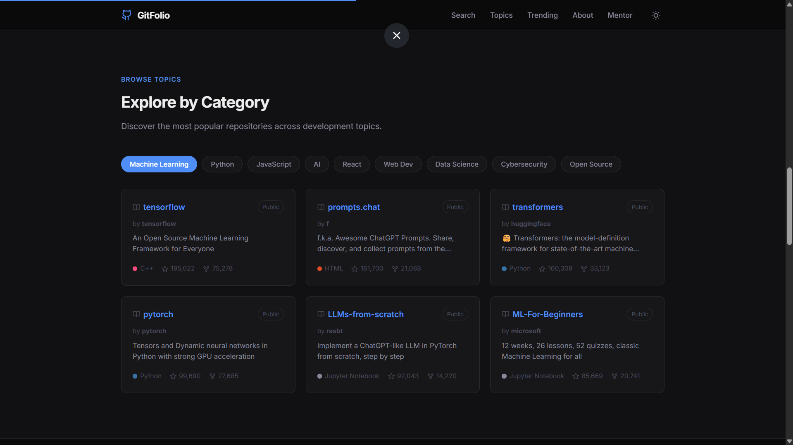
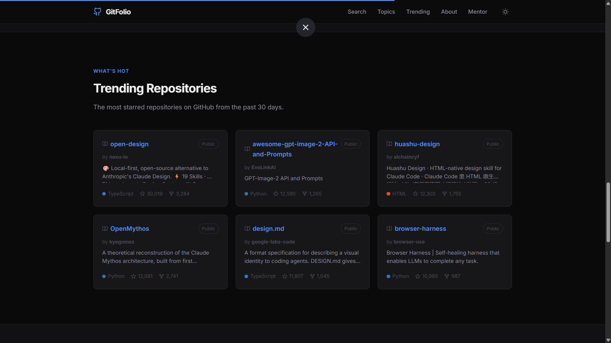
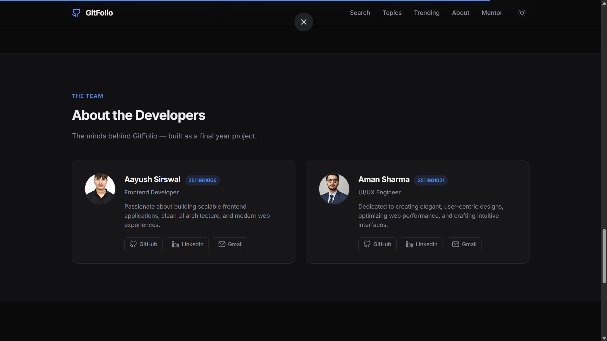
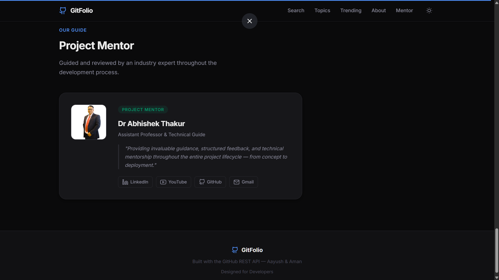

# 🚀 GitFolio

<div align="center">

### Modern GitHub Portfolio & Repository Explorer

Live GitHub profile search, trending repositories, and topic-based discovery built with pure HTML, CSS, and JavaScript.

<br>

[](https://aayush2114.github.io/GitFolio/)
[](https://github.com/Aayush2114/GitFolio)
[](#)
[](#)

</div>

---

# 🌐 Live Website

👉 **Live Demo:**

## [https://aayush2114.github.io/GitFolio/](https://aayush2114.github.io/GitFolio/)

---

# ✨ Project Overview

GitFolio is a modern GitHub Portfolio & Repository Explorer designed to help users:

* 🔍 Search GitHub developers
* 📊 Explore repositories and statistics
* 📈 Discover trending repositories
* 🧠 Browse repositories by technology topics
* 🌙 Switch between dark and light themes
* ⚡ Experience smooth modern UI interactions

The project was built with a strong focus on:

* Modern frontend design
* Clean UI/UX
* Responsive layouts
* API integration
* Smooth animations
* Performance optimization
* Professional presentation quality

---

# 🛠️ Tech Stack

<div align="center">

| Technology              | Usage                   |
| ----------------------- | ----------------------- |
| HTML5                   | Structure               |
| CSS3                    | Styling & Animations    |
| JavaScript (Vanilla JS) | Logic & API Integration |
| GitHub REST API         | Live GitHub Data        |
| GitHub Pages            | Deployment              |

</div>

---

# 🔥 Features

## 👤 GitHub User Search

* Search any GitHub username
* View profile details
* Followers & following count
* Repository statistics
* Top repositories
* Programming languages used

---

## 📚 Topic-Based Repository Discovery

Explore repositories across topics like:

* Machine Learning
* Python
* JavaScript
* AI
* React
* Data Science
* Cybersecurity
* Open Source

---

## 📈 Trending Repositories

* Discover popular repositories
* Live GitHub API data
* Modern responsive repository cards
* Interactive UI

---

## 🎨 Modern UI/UX

* Dark / Light Theme Toggle
* Responsive Design
* Smooth Animations
* Premium Layout
* Skeleton Loading States
* Toast Notifications
* Scroll Reveal Effects

---

# 📸 Project Preview

## 🏠 Homepage


---

## 🔍 GitHub Search


---

## 📚 Topic Discovery


---

## 📈 Trending Repositories


---

## 👨‍💻 About Developers


---

## 🎓 Mentor Section


---

# 📂 Project Structure

```bash
GitFolio/
│
├── index.html
├── style.css
├── script.js
├── Aayush.jpg
├── Aman.jpeg
├── Abhi.png
└── README.md
```

---

# ⚙️ Installation & Setup

## Clone Repository

```bash
git clone https://github.com/Aayush2114/GitFolio.git
```

## Open Project

Simply open:

```bash
index.html
```

in your browser.

---

# 🚀 Deployment

This project is deployed using:

## GitHub Pages

Live Link:

```bash
https://aayush2114.github.io/GitFolio/
```

---

# 👨‍💻 Developers

## 🧑‍💻 Aayush Sirswal

* Frontend Developer
* GitHub: [https://github.com/Aayush2114](https://github.com/Aayush2114)
* LinkedIn: [https://www.linkedin.com/in/aayush-sirswal-56920637b/](https://www.linkedin.com/in/aayush-sirswal-56920637b/)
* Email: [ayushsirswal10@gmail.com](mailto:ayushsirswal10@gmail.com)

---

## 🧑‍💻 Aman Sharma

* UI/UX Engineer
* GitHub: [https://github.com/amansh108](https://github.com/amansh108)
* LinkedIn: [https://www.linkedin.com/in/aman-sharma-10643637b/](https://www.linkedin.com/in/aman-sharma-10643637b/)
* Email: [amanmamtasharma619@gmail.com](mailto:amanmamtasharma619@gmail.com)

---

# 🎓 Project Mentor

## 👨‍🏫 Dr Abhishek Thakur

Assistant Professor & Technical Guide

* GitHub: [https://github.com/abhithakur25](https://github.com/abhithakur25)
* LinkedIn: [https://www.linkedin.com/in/dr-abhishek-thakur-00123321/](https://www.linkedin.com/in/dr-abhishek-thakur-00123321/)
* YouTube: [https://www.youtube.com/@atschooldotin](https://www.youtube.com/@atschooldotin)
* Email: [abhishek@chitkarauniversity.edu.in](mailto:abhishek@chitkarauniversity.edu.in)

---

# 🎯 Learning Outcomes

Through this project, we learned:

* API Integration using Fetch API
* DOM Manipulation
* Responsive Web Design
* UI/UX Principles
* Git & GitHub Workflow
* Deployment using GitHub Pages
* Modern Frontend Development Practices

---

# 📌 Future Improvements

Potential future enhancements:

* Advanced repository filtering
* Repository bookmarking
* Better GitHub analytics
* Charts & visualizations
* Enhanced accessibility
* Search history

---

# ⭐ Support

If you liked this project:

* ⭐ Star the repository
* 🍴 Fork the project
* 📢 Share it with others

---

<div align="center">

## 💙 Built with Passion by Aayush & Aman

### Designed for Developers • Powered by GitHub API

</div>
